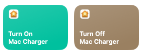

# AutoCharging/DisCharging On Mac 
This repository provides a setup for battery level detection on a Mac, automatically turning charging on or off based on the user's settings.

## Tools Required
- **Home Smart** app (iOS)
- **Shortcuts** app (macOS)
- A smart plug connected to the Mac charger (IKEA ***TRETAKT*** in my case)
- **Automation** app (macOS)
- Terminal

## Basic Setup

First, integrate the IKEA smart plug with the **Home Smart** app. This allows for direct control via the **Shortcuts** app, 
simplifying the automation process.

Follow the guide below to connect your smart plug to the **IKEA Smart** mobile app:
- [IKEA Smart Plug Setup](https://www.ikea.com/au/en/p/tretakt-plug-smart-10556517/)

Once set up, your smart plug should be ready for automation.

### Shortcuts App Setup

1. Open the **Shortcuts** app.
2. Click the add button  in the top corner.
3. Name the shortcut "**Turn On Mac Charger**". 
4. Search for  on the right-hand side and drag it to the left
5. Select the smart plug, click **Next**, and set it to **ON**.
6. Create another shortcut, set it to **OFF**, and name it "**Turn Off Mac Charger**".

Now you should have two new shortcuts:

### Automation App Setup
1. Download and unzip **BatteryMonitorAutomation.app** to your desired location.
2. Note the absolute path, as it will be needed for background execution.
3. If you want to customize the charging/discharging limits, modify the following lines in the script:
   - `if batteryStatus contains "AC Power" and batteryLevel is greater than 95 then`
   
     The discharge limit is currently set to 95%.
   - `else if batteryStatus contains "Battery Power" and batteryLevel is less than 30 then`

     The charging limit is currently set to 30%.

4. Save the file after making changes.

## Running via Terminal
1. Download the attached `.plist` file and move it to
   `/Users/YourUserName/Library/LaunchAgents/com.YourUserName.batterymonitor.plist`. 
2. This file runs the automation app every **5 minutes** and checks the battery level.
   - If the battery is above the set threshold, the charger will turn **off**.
   - If the battery drops below the set threshold, the charger will turn **on**.
   - The interval is controlled by:
     
     `<key>StartInterval</key>`
     
     `<integer>300</integer>`.
   - The system will restart the process in case of errors via:
     
     `<key>KeepAlive</key>`

     `<true/>`.

3. Run the following command to execute the script in the background:

   `launchctl load ~/Library/LaunchAgents/com.YourUserName.batterymonitor.plist`
4. If you modify the `.plist` file or **Automation AppleScript**, you must first **unload** and then **reload** the file:

   `launchctl unload ~/Library/LaunchAgents/com.YourUserName.batterymonitor.plist`

   `launchctl load ~/Library/LaunchAgents/com.YourUserName.batterymonitor.plist`

5. The script runs in the background without printing output to the terminal.

## Further Improvements
I'll later add log files to this repo for monitoring and debugging.

## Conclusion
With this setup, your MacBook’s battery level will be automatically monitored. When the battery reaches the specified level, 
the smart plug will turn the charger **on** or **off**, running in the background without manual intervention. This helps to extend battery 
lifespan by preventing overcharging.

I hope this repository helps! If you have any questions, feel free to reach out at [seattis@gmail.com](mailto:seattis@gmail.com). 🚀

